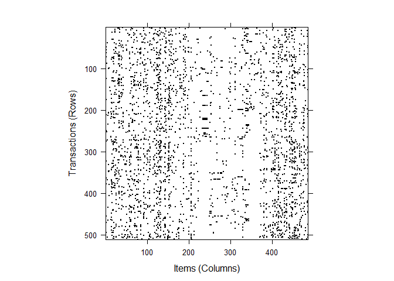
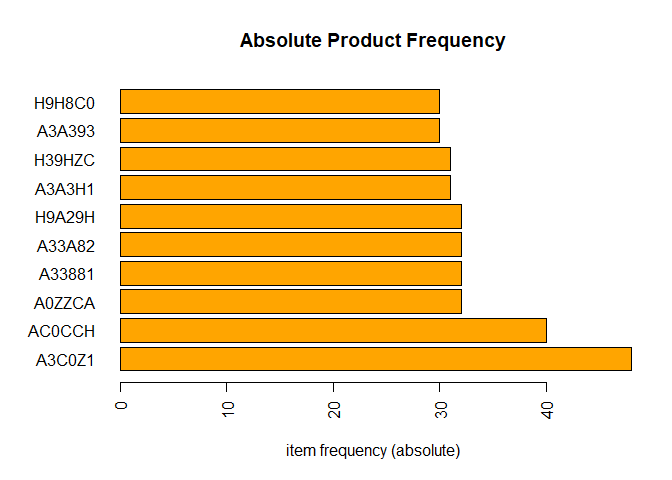
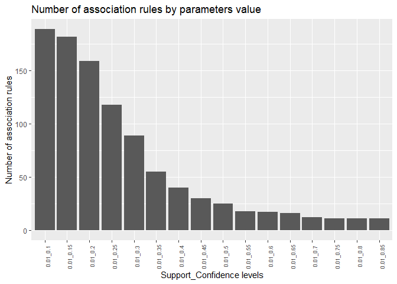

\
\
\
\
\
\

# **Association Rules Mining**
\
\

Association Rules Mining, commonly called Market Basket Analysis is a very helpful technique commonly used by retailers to uncover associations between items.
The idea is to define certain (probability) rules and on that basis identify likelihood that given products' (items) will appear in the same transaction (basket).
Most common and intuitive example of products that are bought together is bread and butter.

Market Basket Analysis is based on three key measures: Support, Lift and Confidence (4th measure, Expected Confidence, can be also considered) and therefore is easy understand and outcome is easy to explain to stakeholders.
Description of key measures: 

* Support can be described as popularity of item(set); it's a fraction (percentage) of all transactions that contain given item(set),
* Confidence tells us how often the rule is true; it shows the percentage in which item B co-occur with item A,
* Lift is an indicator of association strength: 
  - lift > 1: B is likely to co-occur with A
  - lift < 1: B is unlikely to co-occur with A


The key challenge when performing Market Basket was the size of data to process. Recently it has become less problematic due to increase of computational power, however it can still be a problem when summarizing or visualizing results if rules parameters are incorrect.


# **Association Rules Mining in Supply Chain Management**
\
\

Market Basket Analysis can also be applied to supply chain management, specifically to logistics and warehousing. 
The scope of the analysis are customers orders dispatched from a consolidation DC.

The purpose is to investigate if there are any associations between products which can be foundation for SKUs placement in the same area of the DC in order to streamline shipping process and reduce warehouse handling costs related to order preparation process.


# **Analysis**
\
\

## Required packages and dataset
\
\

Let's first upload required packages to perform this analysis.


```r
library(arules)
library(arulesCBA)
library(arulesViz)
library(htmlwidgets)
library(tidyverse)
```


Next step is to bring in data with customers' orders in required format.
We'll use read.transaction function from 'arules' library.


```r
market_order <- read.transactions("data/basket_data.csv",
                                  format = "single",
                                  sep = ",",
                                  header = TRUE,
                                  cols = c("Document", "Product"))
```


## Data exploration
\
\

We can summarize the data to display some simple statistics like number of transactions (orders), their size or most frequent items (SKUs). We could use length() and size() function, however good alternative is summary() which returns enriched piece of information.


```r
summary(market_order)
```

```
## transactions as itemMatrix in sparse format with
##  844 rows (elements/itemsets/transactions) and
##  486 columns (items) and a density of 0.008071987 
## 
## most frequent items:
##  A0ZZCZ  A3C0Z1  AC0CCH  A0ZZCA  A33881 (Other) 
##      71      48      43      32      32    3085 
## 
## element (itemset/transaction) length distribution:
## sizes
##   1   2   3   4   5   6   7   8   9  10  11  12  13  14  15  16  18 
## 333  74  63  60  66  72  52  37  24  19  14   6   7   5   8   3   1 
## 
##    Min. 1st Qu.  Median    Mean 3rd Qu.    Max. 
##   1.000   1.000   3.000   3.923   6.000  18.000 
## 
## includes extended item information - examples:
##   labels
## 1 20A13C
## 2 A0019C
## 3 A00801
## 
## includes extended transaction information - examples:
##   transactionID
## 1   ABABZ33Z596
## 2   ABABZ34569Z
## 3   ABABZ345836
```

There's 844 transactions (customer orders) and 486 items (products).
We can see that there's a handful of orders (transactions) with only one item. 
Let's remove them.


```r
market_order_filter <- market_order[size(market_order) > 1]

summary(market_order_filter)
```

```
## transactions as itemMatrix in sparse format with
##  511 rows (elements/itemsets/transactions) and
##  486 columns (items) and a density of 0.01199133 
## 
## most frequent items:
##  A3C0Z1  AC0CCH  A0ZZCA  A33881  A33A82 (Other) 
##      48      40      32      32      32    2794 
## 
## element (itemset/transaction) length distribution:
## sizes
##  2  3  4  5  6  7  8  9 10 11 12 13 14 15 16 18 
## 74 63 60 66 72 52 37 24 19 14  6  7  5  8  3  1 
## 
##    Min. 1st Qu.  Median    Mean 3rd Qu.    Max. 
##   2.000   3.000   5.000   5.828   7.000  18.000 
## 
## includes extended item information - examples:
##   labels
## 1 20A13C
## 2 A0019C
## 3 A00801
## 
## includes extended transaction information - examples:
##   transactionID
## 1   ABABZ33Z596
## 2   ABABZ34569Z
## 3   ABABZ345836
```
Number of transactions has reduced significantly.

Structure of transactions data can be inspected with inspect() function.


```r
inspect(head(market_order_filter)[1:3])
```

```
##     items    transactionID
## [1] {A11A88,              
##      A2C332,              
##      A3C9AC,              
##      A3ZC22,              
##      H9H883}   ABABZ33Z596
## [2] {A20Z92,              
##      A31988,              
##      A3199C,              
##      AC90HC,              
##      H39A38,              
##      H9A29H,              
##      HA8ZCA}   ABABZ34569Z
## [3] {A0ZH83,              
##      A0ZZCA,              
##      A1CCC9,              
##      A33A82,              
##      A3A393,              
##      AZ1C23,              
##      AZ313Z,              
##      AZ3188}   ABABZ345836
```


At this stage we should perform Chi-Square test to check if co-occurrence of (at least some) items is dependent or not.

HO: co-occurrence of rows & columns (items) is independent (p-value > alpha)

HA: co-occurrence of rows & columns (items) is dependent of each other (p-value < alpha)


```r
crossTable(market_order_filter, measure = "chiSquared", sort = TRUE)[1:10, 1:10]
```

```
##              A3C0Z1      AC0CCH       A0ZZCA       A33881      A33A82
## A3C0Z1           NA 0.005476486 0.0025889005 0.0006434198 0.005836464
## AC0CCH 0.0054764861          NA 0.0017692977 0.0001915090 0.000191509
## A0ZZCA 0.0025889005 0.001769298           NA 0.0038909763 0.008766144
## A33881 0.0006434198 0.000191509 0.0038909763           NA 0.062438860
## A33A82 0.0058364645 0.000191509 0.0087661445 0.0624388604          NA
## H9A29H 0.0006587084 0.015785932 0.0039215536 0.0039215536 0.003921554
## A3A3H1 0.0112313548 0.001996405 0.0094311463 0.0166059617 0.001129903
## H39HZC 0.0029301112 0.016867625 0.0011299027 0.0257969061 0.009431146
## A3A393 0.0033063242 0.005859432 0.0101486516 0.0273208629 0.052826408
## H9H8C0 0.0033063242 0.002273327 0.0008042289 0.0008042289 0.003676457
##              H9A29H      A3A3H1       H39HZC      A3A393       H9H8C0
## A3C0Z1 0.0006587084 0.011231355 2.930111e-03 0.003306324 3.306324e-03
## AC0CCH 0.0157859317 0.001996405 1.686763e-02 0.005859432 2.273327e-03
## A0ZZCA 0.0039215536 0.009431146 1.129903e-03 0.010148652 8.042289e-04
## A33881 0.0039215536 0.016605962 2.579691e-02 0.027320863 8.042289e-04
## A33A82 0.0039215536 0.001129903 9.431146e-03 0.052826408 3.676457e-03
## H9A29H           NA 0.003799005 3.799005e-03 0.003676457 4.687546e-03
## A3A3H1 0.0037990051          NA 1.012538e-02 0.055433293 3.561567e-03
## H39HZC 0.0037990051 0.010125383           NA 0.001497304 3.485386e-05
## A3A393 0.0036764565 0.055433293 1.497304e-03          NA 3.446678e-03
## H9H8C0 0.0046875459 0.003561567 3.485386e-05 0.003446678           NA
```
On the basis of visual inspection of sub-matrix made of ten most frequent items we can reject Null Hypothesis (H0) in favor of Alternative Hypothesis as we can find examples of alpha values greater than p-value of 0.05.


Let's see transactions sparsity

```r
image(market_order_filter)
```

<!-- -->


Most frequent items can also be visualized.

```r
itemFrequencyPlot(market_order_filter,
                  topN = 10,
                  main = "Absolute Product Frequency",
                  type = "absolute",
                  horiz = TRUE,
                  col = "orange")
```

<!-- -->


## Association Rules Mining
\
\

Having confirmed co-occurrence of items we can perform Association Rules Mining.

First step is define values of parameters for association rules (in other words, we need to decide on thresholds for key metrics).
It's an important step when we deal with large datasets as it will define the number of association rules and therefore granularity of analysis and its outcome. It is recommended to use expertise knowledge to find the optimal number applicable to a given business environment, however this process can be supported with visual representation of numbers of expected rules.

This task is usually done on the basis of Confidence and Support. Let's define a grid of parameters and investigate thresholds that will help us select optimal number of rules captured by iterating apriori algorithm over the grid.


```r
# selecting support & confidence level parameters

supp_lev <- seq(from = 0.01, to = 0.2, by = 0.01)
conf_lev <- seq(from = 0.1, to = 0.9, by = 0.05)

par_check <- expand.grid(supp_level = supp_lev, 
                         conf_level = conf_lev) %>%
  cbind(count = NA)


for (i in 1:nrow(par_check)) {
  par_check[i, 3] =
    length(apriori(market_order_filter,
                   parameter = list(supp = par_check[i, 1],
                                    conf = par_check[i, 2],
                                    target = "rules")))
}
```

Let's filter entire dataset to return a pair of association metrics that return
at least 10 rules.


```r
par_check_filter <- par_check %>%
  as_tibble() %>%
  filter(count >= 10) %>%
  mutate(
    supp_level = as.character(supp_level),
    conf_level = as.character(conf_level)) %>%
  unite(col = par_pair,
        supp_level, 
        conf_level,
        remove = FALSE)
```

Results can be visualized with a help of ggplot package.


```r
ggplot(par_check_filter,
       aes(x = par_pair,
           y = count)) +
  geom_col() +
  theme(
    axis.text.x = element_text(angle = 90,
                               size = 7)
  ) +
  labs(title = "Number of association rules by parameters value",
       x =  "Support_Confidence levels",
       y = "Number of association rules")
```

<div class="figure">

<p class="caption">Number of association rules between Brands based on combination of Support and Confidence levels.</p>
</div>

Let's use support level of 0.01 and confidence of 0.5. In other words, we pick items that appear at least in 1% of all transactions and minimum confidence of 50% that co-occurrence between items is true.

To uncover rules, apriori function (algorithm) is used. What's returned is controlled by target parameter. Let's first set it to 'frequent itemsets', .


```r
trans_frequent <- apriori(market_order_filter,
                         parameter = list(
                           supp = 0.01,
                           conf = 0.5,
                           target = "frequent itemsets")
                         )
```

Results can be retrieved with inspect() function.


```r
prod_apriori_inspect <- inspect(head(sort(trans_frequent, 
                                     by = "support")
                                )
)
```

Kable() function offers nice formatting.


```r
prod_apriori_inspect %>% 
  knitr::kable()
```

      items         support   transIdenticalToItemsets   count
----  ---------  ----------  -------------------------  ------
[1]   {A3C0Z1}    0.0939335                  0.0000000      48
[2]   {AC0CCH}    0.0782779                  0.0058708      40
[3]   {H9A29H}    0.0626223                  0.0000000      32
[4]   {A0ZZCA}    0.0626223                  0.0000000      32
[5]   {A33A82}    0.0626223                  0.0000000      32
[6]   {A33881}    0.0626223                  0.0000000      32

Setting target to 'rules' allows inspection of association rules and all key metrics they're based on.


```r
trans_rules <- apriori(market_order_filter,
                         parameter = list(
                           supp = 0.01,
                           conf = 0.5,
                           target = "rules"),
                      control = list(verbose = FALSE)
)

#saveRDS(trans_rules, file = 'data/trans_rules.RDS')
```


```r
trans_rules_inspect <- inspect(head(
  sort(
    trans_rules, 
    by = "lift")
  )
)
```


```r
trans_rules_inspect %>%
  knitr::kable()
```

      lhs                    rhs           support   confidence    coverage       lift   count
----  ----------------  ---  ---------  ----------  -----------  ----------  ---------  ------
[1]   {AC9ACH}          =>   {AC9A92}    0.0117417            1   0.0117417   85.16667       6
[2]   {AC9A92}          =>   {AC9ACH}    0.0117417            1   0.0117417   85.16667       6
[3]   {AC9AC2,AC9ACH}   =>   {AC9A92}    0.0117417            1   0.0117417   85.16667       6
[4]   {AC9A92,AC9AC2}   =>   {AC9ACH}    0.0117417            1   0.0117417   85.16667       6
[5]   {AC9AA8}          =>   {AC9AC2}    0.0117417            1   0.0117417   56.77778       6
[6]   {AC9AC1}          =>   {AC9AC2}    0.0117417            1   0.0117417   56.77778       6

Rules can also be subset based on certain conditions.


```r
rules_subset <- inspect(subset(trans_frequent,
                               subset = items %in% c("A338HC") & support > 0.01)
                        )
```


```r
rules_subset %>%
  knitr::kable()
```

      items                support   transIdenticalToItemsets   count
----  ----------------  ----------  -------------------------  ------
[1]   {A338HC}           0.0450098                          0      23
[2]   {A338HC,ACZ029}    0.0117417                          0       6
[3]   {A338HC,H39A38}    0.0117417                          0       6
[4]   {A338HC,A3H933}    0.0136986                          0       7
[5]   {A338HC,H9A29H}    0.0176125                          0       9


## Rules visualization
\
\

Association rules can be visualized. In addition to that, good level of interaction is provided for user.

* plot

```r
plot(trans_rules, engine = "plotly")
```

```{=html}
<div id="htmlwidget-72722294f6c12b5194a2" style="width:672px;height:480px;" class="plotly html-widget"></div>
<script type="application/json" data-for="htmlwidget-72722294f6c12b5194a2">{"x":{"visdat":{"1a24d30528":["function () ","plotlyVisDat"]},"cur_data":"1a24d30528","attrs":{"1a24d30528":{"x":[0.0117125285821563,0.0137331925596055,0.0136752969540376,0.0136652056158198,0.0137158655099401,0.0117740518872285,0.0117445286039409,0.0117785976098198,0.0117503569928288,0.0117463330155683,0.0136981893880142,0.0137117462708442,0.0117627518729684,0.0117092713016939,0.0117400925551804,0.0117586605417343,0.01171352472813,0.0117062002499129,0.0117691665636546,0.0117137764513156,0.0117614516316299,0.0117031533165385,0.0117682823919769,0.011761532345668,0.0117130948869165],"y":[0.545461178007624,0.50009618164571,0.538417853657965,0.700139248899464,0.538448496494264,0.500099040748915,0.600113807814932,0.545386253105211,0.857273384179569,0.500008201411087,0.875107754916595,0.583415667342631,0.666803658507472,0.666740137612993,0.666586631085609,0.666714582165225,1.00004240386899,0.999946572753023,0.999881320754001,0.99992377276673,0.999953981482117,0.999915322848568,0.999877634781552,1.00001584823848,0.99993927053635],"hoverinfo":"text","text":["[20]<BR> <B>{A389C3}<\/B><BR>&nbsp;&nbsp; => <B>{H9A29H}<\/B> <BR><BR>support: 0.0117 <BR>confidence: 0.545 <BR>lift: 8.71","[21]<BR> <B>{H9AC0A}<\/B><BR>&nbsp;&nbsp; => <B>{H8380Z}<\/B> <BR><BR>support: 0.0137 <BR>confidence: 0.5 <BR>lift: 8.81","[19]<BR> <B>{H8A1C1}<\/B><BR>&nbsp;&nbsp; => <B>{H8380Z}<\/B> <BR><BR>support: 0.0137 <BR>confidence: 0.538 <BR>lift: 9.49","[18]<BR> <B>{HA90A2}<\/B><BR>&nbsp;&nbsp; => <B>{H989Z3}<\/B> <BR><BR>support: 0.0137 <BR>confidence: 0.7 <BR>lift: 13.2","[22]<BR> <B>{H88229}<\/B><BR>&nbsp;&nbsp; => <B>{A09089}<\/B> <BR><BR>support: 0.0137 <BR>confidence: 0.538 <BR>lift: 13.8","[17]<BR> <B>{A330H0}<\/B><BR>&nbsp;&nbsp; => <B>{A1C92A}<\/B> <BR><BR>support: 0.0117 <BR>confidence: 0.5 <BR>lift: 15","[13]<BR> <B>{H882ZC}<\/B><BR>&nbsp;&nbsp; => <B>{A10H29}<\/B> <BR><BR>support: 0.0117 <BR>confidence: 0.6 <BR>lift: 19.2","[14]<BR> <B>{A0ZZA8}<\/B><BR>&nbsp;&nbsp; => <B>{H9A3C1}<\/B> <BR><BR>support: 0.0117 <BR>confidence: 0.545 <BR>lift: 19.9","[15]<BR> <B>{AZ1C20}<\/B><BR>&nbsp;&nbsp; => <B>{AZ1C23}<\/B> <BR><BR>support: 0.0117 <BR>confidence: 0.857 <BR>lift: 36.5","[16]<BR> <B>{AZ1C23}<\/B><BR>&nbsp;&nbsp; => <B>{AZ1C20}<\/B> <BR><BR>support: 0.0117 <BR>confidence: 0.5 <BR>lift: 36.5","[1]<BR> <B>{AZ1C2C}<\/B><BR>&nbsp;&nbsp; => <B>{AZ1C21}<\/B> <BR><BR>support: 0.0137 <BR>confidence: 0.875 <BR>lift: 37.3","[2]<BR> <B>{AZ1C21}<\/B><BR>&nbsp;&nbsp; => <B>{AZ1C2C}<\/B> <BR><BR>support: 0.0137 <BR>confidence: 0.583 <BR>lift: 37.3","[4]<BR> <B>{AC9AC2}<\/B><BR>&nbsp;&nbsp; => <B>{AC9AA8}<\/B> <BR><BR>support: 0.0117 <BR>confidence: 0.667 <BR>lift: 56.8","[6]<BR> <B>{AC9AC2}<\/B><BR>&nbsp;&nbsp; => <B>{AC9AC1}<\/B> <BR><BR>support: 0.0117 <BR>confidence: 0.667 <BR>lift: 56.8","[10]<BR> <B>{AC9AC2}<\/B><BR>&nbsp;&nbsp; => <B>{AC9ACH}<\/B> <BR><BR>support: 0.0117 <BR>confidence: 0.667 <BR>lift: 56.8","[12]<BR> <B>{AC9AC2}<\/B><BR>&nbsp;&nbsp; => <B>{AC9A92}<\/B> <BR><BR>support: 0.0117 <BR>confidence: 0.667 <BR>lift: 56.8","[3]<BR> <B>{AC9AA8}<\/B><BR>&nbsp;&nbsp; => <B>{AC9AC2}<\/B> <BR><BR>support: 0.0117 <BR>confidence: 1 <BR>lift: 56.8","[5]<BR> <B>{AC9AC1}<\/B><BR>&nbsp;&nbsp; => <B>{AC9AC2}<\/B> <BR><BR>support: 0.0117 <BR>confidence: 1 <BR>lift: 56.8","[9]<BR> <B>{AC9ACH}<\/B><BR>&nbsp;&nbsp; => <B>{AC9AC2}<\/B> <BR><BR>support: 0.0117 <BR>confidence: 1 <BR>lift: 56.8","[11]<BR> <B>{AC9A92}<\/B><BR>&nbsp;&nbsp; => <B>{AC9AC2}<\/B> <BR><BR>support: 0.0117 <BR>confidence: 1 <BR>lift: 56.8","[23]<BR> <B>{AC9A92,<BR>&nbsp;&nbsp;AC9ACH}<\/B><BR>&nbsp;&nbsp; => <B>{AC9AC2}<\/B> <BR><BR>support: 0.0117 <BR>confidence: 1 <BR>lift: 56.8","[7]<BR> <B>{AC9ACH}<\/B><BR>&nbsp;&nbsp; => <B>{AC9A92}<\/B> <BR><BR>support: 0.0117 <BR>confidence: 1 <BR>lift: 85.2","[8]<BR> <B>{AC9A92}<\/B><BR>&nbsp;&nbsp; => <B>{AC9ACH}<\/B> <BR><BR>support: 0.0117 <BR>confidence: 1 <BR>lift: 85.2","[24]<BR> <B>{AC9AC2,<BR>&nbsp;&nbsp;AC9ACH}<\/B><BR>&nbsp;&nbsp; => <B>{AC9A92}<\/B> <BR><BR>support: 0.0117 <BR>confidence: 1 <BR>lift: 85.2","[25]<BR> <B>{AC9A92,<BR>&nbsp;&nbsp;AC9AC2}<\/B><BR>&nbsp;&nbsp; => <B>{AC9ACH}<\/B> <BR><BR>support: 0.0117 <BR>confidence: 1 <BR>lift: 85.2"],"mode":"markers","marker":[],"color":[8.71022727272727,8.81034482758621,9.48806366047745,13.2481481481481,13.7576923076923,15.0294117647059,19.1625,19.9090909090909,36.5,36.5,37.2604166666667,37.2604166666667,56.7777777777778,56.7777777777778,56.7777777777778,56.7777777777778,56.7777777777778,56.7777777777778,56.7777777777778,56.7777777777778,56.7777777777778,85.1666666666667,85.1666666666667,85.1666666666667,85.1666666666667],"colors":["#EEEEEEFF","#EE0000FF"],"alpha_stroke":1,"sizes":[10,100],"spans":[1,20],"type":"scatter"}},"layout":{"margin":{"b":40,"l":60,"t":25,"r":10},"xaxis":{"domain":[0,1],"automargin":true,"title":"support"},"yaxis":{"domain":[0,1],"automargin":true,"title":"confidence"},"hovermode":"closest","showlegend":false,"legend":{"yanchor":"top","y":0.5}},"source":"A","config":{"showSendToCloud":false},"data":[{"x":[0.0117125285821563,0.0137331925596055,0.0136752969540376,0.0136652056158198,0.0137158655099401,0.0117740518872285,0.0117445286039409,0.0117785976098198,0.0117503569928288,0.0117463330155683,0.0136981893880142,0.0137117462708442,0.0117627518729684,0.0117092713016939,0.0117400925551804,0.0117586605417343,0.01171352472813,0.0117062002499129,0.0117691665636546,0.0117137764513156,0.0117614516316299,0.0117031533165385,0.0117682823919769,0.011761532345668,0.0117130948869165],"y":[0.545461178007624,0.50009618164571,0.538417853657965,0.700139248899464,0.538448496494264,0.500099040748915,0.600113807814932,0.545386253105211,0.857273384179569,0.500008201411087,0.875107754916595,0.583415667342631,0.666803658507472,0.666740137612993,0.666586631085609,0.666714582165225,1.00004240386899,0.999946572753023,0.999881320754001,0.99992377276673,0.999953981482117,0.999915322848568,0.999877634781552,1.00001584823848,0.99993927053635],"hoverinfo":["text","text","text","text","text","text","text","text","text","text","text","text","text","text","text","text","text","text","text","text","text","text","text","text","text"],"text":["[20]<BR> <B>{A389C3}<\/B><BR>&nbsp;&nbsp; => <B>{H9A29H}<\/B> <BR><BR>support: 0.0117 <BR>confidence: 0.545 <BR>lift: 8.71","[21]<BR> <B>{H9AC0A}<\/B><BR>&nbsp;&nbsp; => <B>{H8380Z}<\/B> <BR><BR>support: 0.0137 <BR>confidence: 0.5 <BR>lift: 8.81","[19]<BR> <B>{H8A1C1}<\/B><BR>&nbsp;&nbsp; => <B>{H8380Z}<\/B> <BR><BR>support: 0.0137 <BR>confidence: 0.538 <BR>lift: 9.49","[18]<BR> <B>{HA90A2}<\/B><BR>&nbsp;&nbsp; => <B>{H989Z3}<\/B> <BR><BR>support: 0.0137 <BR>confidence: 0.7 <BR>lift: 13.2","[22]<BR> <B>{H88229}<\/B><BR>&nbsp;&nbsp; => <B>{A09089}<\/B> <BR><BR>support: 0.0137 <BR>confidence: 0.538 <BR>lift: 13.8","[17]<BR> <B>{A330H0}<\/B><BR>&nbsp;&nbsp; => <B>{A1C92A}<\/B> <BR><BR>support: 0.0117 <BR>confidence: 0.5 <BR>lift: 15","[13]<BR> <B>{H882ZC}<\/B><BR>&nbsp;&nbsp; => <B>{A10H29}<\/B> <BR><BR>support: 0.0117 <BR>confidence: 0.6 <BR>lift: 19.2","[14]<BR> <B>{A0ZZA8}<\/B><BR>&nbsp;&nbsp; => <B>{H9A3C1}<\/B> <BR><BR>support: 0.0117 <BR>confidence: 0.545 <BR>lift: 19.9","[15]<BR> <B>{AZ1C20}<\/B><BR>&nbsp;&nbsp; => <B>{AZ1C23}<\/B> <BR><BR>support: 0.0117 <BR>confidence: 0.857 <BR>lift: 36.5","[16]<BR> <B>{AZ1C23}<\/B><BR>&nbsp;&nbsp; => <B>{AZ1C20}<\/B> <BR><BR>support: 0.0117 <BR>confidence: 0.5 <BR>lift: 36.5","[1]<BR> <B>{AZ1C2C}<\/B><BR>&nbsp;&nbsp; => <B>{AZ1C21}<\/B> <BR><BR>support: 0.0137 <BR>confidence: 0.875 <BR>lift: 37.3","[2]<BR> <B>{AZ1C21}<\/B><BR>&nbsp;&nbsp; => <B>{AZ1C2C}<\/B> <BR><BR>support: 0.0137 <BR>confidence: 0.583 <BR>lift: 37.3","[4]<BR> <B>{AC9AC2}<\/B><BR>&nbsp;&nbsp; => <B>{AC9AA8}<\/B> <BR><BR>support: 0.0117 <BR>confidence: 0.667 <BR>lift: 56.8","[6]<BR> <B>{AC9AC2}<\/B><BR>&nbsp;&nbsp; => <B>{AC9AC1}<\/B> <BR><BR>support: 0.0117 <BR>confidence: 0.667 <BR>lift: 56.8","[10]<BR> <B>{AC9AC2}<\/B><BR>&nbsp;&nbsp; => <B>{AC9ACH}<\/B> <BR><BR>support: 0.0117 <BR>confidence: 0.667 <BR>lift: 56.8","[12]<BR> <B>{AC9AC2}<\/B><BR>&nbsp;&nbsp; => <B>{AC9A92}<\/B> <BR><BR>support: 0.0117 <BR>confidence: 0.667 <BR>lift: 56.8","[3]<BR> <B>{AC9AA8}<\/B><BR>&nbsp;&nbsp; => <B>{AC9AC2}<\/B> <BR><BR>support: 0.0117 <BR>confidence: 1 <BR>lift: 56.8","[5]<BR> <B>{AC9AC1}<\/B><BR>&nbsp;&nbsp; => <B>{AC9AC2}<\/B> <BR><BR>support: 0.0117 <BR>confidence: 1 <BR>lift: 56.8","[9]<BR> <B>{AC9ACH}<\/B><BR>&nbsp;&nbsp; => <B>{AC9AC2}<\/B> <BR><BR>support: 0.0117 <BR>confidence: 1 <BR>lift: 56.8","[11]<BR> <B>{AC9A92}<\/B><BR>&nbsp;&nbsp; => <B>{AC9AC2}<\/B> <BR><BR>support: 0.0117 <BR>confidence: 1 <BR>lift: 56.8","[23]<BR> <B>{AC9A92,<BR>&nbsp;&nbsp;AC9ACH}<\/B><BR>&nbsp;&nbsp; => <B>{AC9AC2}<\/B> <BR><BR>support: 0.0117 <BR>confidence: 1 <BR>lift: 56.8","[7]<BR> <B>{AC9ACH}<\/B><BR>&nbsp;&nbsp; => <B>{AC9A92}<\/B> <BR><BR>support: 0.0117 <BR>confidence: 1 <BR>lift: 85.2","[8]<BR> <B>{AC9A92}<\/B><BR>&nbsp;&nbsp; => <B>{AC9ACH}<\/B> <BR><BR>support: 0.0117 <BR>confidence: 1 <BR>lift: 85.2","[24]<BR> <B>{AC9AC2,<BR>&nbsp;&nbsp;AC9ACH}<\/B><BR>&nbsp;&nbsp; => <B>{AC9A92}<\/B> <BR><BR>support: 0.0117 <BR>confidence: 1 <BR>lift: 85.2","[25]<BR> <B>{AC9A92,<BR>&nbsp;&nbsp;AC9AC2}<\/B><BR>&nbsp;&nbsp; => <B>{AC9ACH}<\/B> <BR><BR>support: 0.0117 <BR>confidence: 1 <BR>lift: 85.2"],"mode":"markers","type":"scatter","marker":{"colorbar":{"title":"","ticklen":2},"cmin":8.71022727272727,"cmax":85.1666666666667,"colorscale":[["0","rgba(238,238,238,1)"],["0.0416666666666667","rgba(241,231,228,1)"],["0.0833333333333333","rgba(244,223,218,1)"],["0.125","rgba(247,216,208,1)"],["0.166666666666667","rgba(249,208,198,1)"],["0.208333333333333","rgba(251,201,188,1)"],["0.25","rgba(252,193,178,1)"],["0.291666666666667","rgba(253,186,168,1)"],["0.333333333333333","rgba(254,178,158,1)"],["0.375","rgba(255,170,149,1)"],["0.416666666666667","rgba(255,163,139,1)"],["0.458333333333333","rgba(255,155,130,1)"],["0.5","rgba(255,147,120,1)"],["0.541666666666667","rgba(255,139,111,1)"],["0.583333333333333","rgba(254,131,102,1)"],["0.625","rgba(253,123,92,1)"],["0.666666666666667","rgba(252,114,83,1)"],["0.708333333333333","rgba(251,105,74,1)"],["0.75","rgba(250,96,65,1)"],["0.791666666666667","rgba(248,86,56,1)"],["0.833333333333333","rgba(246,76,46,1)"],["0.875","rgba(245,65,37,1)"],["0.916666666666667","rgba(242,51,26,1)"],["0.958333333333333","rgba(240,34,14,1)"],["1","rgba(238,0,0,1)"]],"showscale":false,"color":[8.71022727272727,8.81034482758621,9.48806366047745,13.2481481481481,13.7576923076923,15.0294117647059,19.1625,19.9090909090909,36.5,36.5,37.2604166666667,37.2604166666667,56.7777777777778,56.7777777777778,56.7777777777778,56.7777777777778,56.7777777777778,56.7777777777778,56.7777777777778,56.7777777777778,56.7777777777778,85.1666666666667,85.1666666666667,85.1666666666667,85.1666666666667],"line":{"colorbar":{"title":"","ticklen":2},"cmin":8.71022727272727,"cmax":85.1666666666667,"colorscale":[["0","rgba(238,238,238,1)"],["0.0416666666666667","rgba(241,231,228,1)"],["0.0833333333333333","rgba(244,223,218,1)"],["0.125","rgba(247,216,208,1)"],["0.166666666666667","rgba(249,208,198,1)"],["0.208333333333333","rgba(251,201,188,1)"],["0.25","rgba(252,193,178,1)"],["0.291666666666667","rgba(253,186,168,1)"],["0.333333333333333","rgba(254,178,158,1)"],["0.375","rgba(255,170,149,1)"],["0.416666666666667","rgba(255,163,139,1)"],["0.458333333333333","rgba(255,155,130,1)"],["0.5","rgba(255,147,120,1)"],["0.541666666666667","rgba(255,139,111,1)"],["0.583333333333333","rgba(254,131,102,1)"],["0.625","rgba(253,123,92,1)"],["0.666666666666667","rgba(252,114,83,1)"],["0.708333333333333","rgba(251,105,74,1)"],["0.75","rgba(250,96,65,1)"],["0.791666666666667","rgba(248,86,56,1)"],["0.833333333333333","rgba(246,76,46,1)"],["0.875","rgba(245,65,37,1)"],["0.916666666666667","rgba(242,51,26,1)"],["0.958333333333333","rgba(240,34,14,1)"],["1","rgba(238,0,0,1)"]],"showscale":false,"color":[8.71022727272727,8.81034482758621,9.48806366047745,13.2481481481481,13.7576923076923,15.0294117647059,19.1625,19.9090909090909,36.5,36.5,37.2604166666667,37.2604166666667,56.7777777777778,56.7777777777778,56.7777777777778,56.7777777777778,56.7777777777778,56.7777777777778,56.7777777777778,56.7777777777778,56.7777777777778,85.1666666666667,85.1666666666667,85.1666666666667,85.1666666666667]}},"xaxis":"x","yaxis":"y","frame":null},{"x":[0.0117031533165385,0.0137331925596055],"y":[0.500008201411087,1.00004240386899],"type":"scatter","mode":"markers","opacity":0,"hoverinfo":"none","showlegend":false,"marker":{"colorbar":{"title":"lift","ticklen":2,"len":0.5,"lenmode":"fraction","y":1,"yanchor":"top"},"cmin":8.71022727272727,"cmax":85.1666666666667,"colorscale":[["0","rgba(238,238,238,1)"],["0.0416666666666667","rgba(241,231,228,1)"],["0.0833333333333333","rgba(244,223,218,1)"],["0.125","rgba(247,216,208,1)"],["0.166666666666667","rgba(249,208,198,1)"],["0.208333333333333","rgba(251,201,188,1)"],["0.25","rgba(252,193,178,1)"],["0.291666666666667","rgba(253,186,168,1)"],["0.333333333333333","rgba(254,178,158,1)"],["0.375","rgba(255,170,149,1)"],["0.416666666666667","rgba(255,163,139,1)"],["0.458333333333333","rgba(255,155,130,1)"],["0.5","rgba(255,147,120,1)"],["0.541666666666667","rgba(255,139,111,1)"],["0.583333333333333","rgba(254,131,102,1)"],["0.625","rgba(253,123,92,1)"],["0.666666666666667","rgba(252,114,83,1)"],["0.708333333333333","rgba(251,105,74,1)"],["0.75","rgba(250,96,65,1)"],["0.791666666666667","rgba(248,86,56,1)"],["0.833333333333333","rgba(246,76,46,1)"],["0.875","rgba(245,65,37,1)"],["0.916666666666667","rgba(242,51,26,1)"],["0.958333333333333","rgba(240,34,14,1)"],["1","rgba(238,0,0,1)"]],"showscale":true,"color":[8.71022727272727,85.1666666666667],"line":{"color":"rgba(255,127,14,1)"}},"xaxis":"x","yaxis":"y","frame":null}],"highlight":{"on":"plotly_click","persistent":false,"dynamic":false,"selectize":false,"opacityDim":0.2,"selected":{"opacity":1},"debounce":0},"shinyEvents":["plotly_hover","plotly_click","plotly_selected","plotly_relayout","plotly_brushed","plotly_brushing","plotly_clickannotation","plotly_doubleclick","plotly_deselect","plotly_afterplot","plotly_sunburstclick"],"base_url":"https://plot.ly"},"evals":[],"jsHooks":[]}</script>
```

* graph


```r
plot(trans_rules, method = "graph",
     engine = "htmlwidget")
```

```{=html}
<div id="htmlwidget-bc63c37a3a1d34aedc95" style="width:672px;height:480px;" class="visNetwork html-widget"></div>
<script type="application/json" data-for="htmlwidget-bc63c37a3a1d34aedc95">{"x":{"nodes":{"id":[1,2,3,4,5,6,7,8,9,10,11,12,13,14,15,16,17,18,19,20,21,22,23,24,25,26,27,28,29,30,31,32,33,34,35,36,37,38,39,40,41,42,43,44,45,46,47,48,49],"label":["AZ1C2C","AZ1C21","AC9AA8","AC9AC2","AC9AC1","AC9ACH","AC9A92","H882ZC","A0ZZA8","AZ1C20","AZ1C23","A330H0","HA90A2","H8A1C1","A389C3","H9AC0A","H88229","A10H29","H9A3C1","A1C92A","H989Z3","H8380Z","H9A29H","A09089","rule 1","rule 2","rule 3","rule 4","rule 5","rule 6","rule 7","rule 8","rule 9","rule 10","rule 11","rule 12","rule 13","rule 14","rule 15","rule 16","rule 17","rule 18","rule 19","rule 20","rule 21","rule 22","rule 23","rule 24","rule 25"],"group":["item","item","item","item","item","item","item","item","item","item","item","item","item","item","item","item","item","item","item","item","item","item","item","item","rule","rule","rule","rule","rule","rule","rule","rule","rule","rule","rule","rule","rule","rule","rule","rule","rule","rule","rule","rule","rule","rule","rule","rule","rule"],"value":[1,1,1,1,1,1,1,1,1,1,1,1,1,1,1,1,1,1,1,1,1,1,1,1,100,100,1,1,1,1,1,1,1,1,1,1,1,1,1,1,1,100,100,1,100,100,1,1,1],"color":["#CBD2FC","#CBD2FC","#CBD2FC","#CBD2FC","#CBD2FC","#CBD2FC","#CBD2FC","#CBD2FC","#CBD2FC","#CBD2FC","#CBD2FC","#CBD2FC","#CBD2FC","#CBD2FC","#CBD2FC","#CBD2FC","#CBD2FC","#CBD2FC","#CBD2FC","#CBD2FC","#CBD2FC","#CBD2FC","#CBD2FC","#CBD2FC","#EEA9A9","#EEA9A9","#EE7878","#EE7878","#EE7878","#EE7878","#EE1B1B","#EE1B1B","#EE7878","#EE7878","#EE7878","#EE7878","#EEC9C9","#EEC8C8","#EEABAB","#EEABAB","#EED0D0","#EED4D4","#EEDBDB","#EEDCDC","#EEDBDB","#EED2D2","#EE7878","#EE1B1B","#EE1B1B"],"title":["AZ1C2C","AZ1C21","AC9AA8","AC9AC2","AC9AC1","AC9ACH","AC9A92","H882ZC","A0ZZA8","AZ1C20","AZ1C23","A330H0","HA90A2","H8A1C1","A389C3","H9AC0A","H88229","A10H29","H9A3C1","A1C92A","H989Z3","H8380Z","H9A29H","A09089","<B>[1]<\/B><BR><B>{AZ1C2C}<\/B><BR>&nbsp;&nbsp; => <B>{AZ1C21}<\/B><BR><BR>support = 0.0137<BR>confidence = 0.875<BR>coverage = 0.0157<BR>lift = 37.3<BR>count = 7<BR>order = 2","<B>[2]<\/B><BR><B>{AZ1C21}<\/B><BR>&nbsp;&nbsp; => <B>{AZ1C2C}<\/B><BR><BR>support = 0.0137<BR>confidence = 0.583<BR>coverage = 0.0235<BR>lift = 37.3<BR>count = 7<BR>order = 2","<B>[3]<\/B><BR><B>{AC9AA8}<\/B><BR>&nbsp;&nbsp; => <B>{AC9AC2}<\/B><BR><BR>support = 0.0117<BR>confidence = 1<BR>coverage = 0.0117<BR>lift = 56.8<BR>count = 6<BR>order = 2","<B>[4]<\/B><BR><B>{AC9AC2}<\/B><BR>&nbsp;&nbsp; => <B>{AC9AA8}<\/B><BR><BR>support = 0.0117<BR>confidence = 0.667<BR>coverage = 0.0176<BR>lift = 56.8<BR>count = 6<BR>order = 2","<B>[5]<\/B><BR><B>{AC9AC1}<\/B><BR>&nbsp;&nbsp; => <B>{AC9AC2}<\/B><BR><BR>support = 0.0117<BR>confidence = 1<BR>coverage = 0.0117<BR>lift = 56.8<BR>count = 6<BR>order = 2","<B>[6]<\/B><BR><B>{AC9AC2}<\/B><BR>&nbsp;&nbsp; => <B>{AC9AC1}<\/B><BR><BR>support = 0.0117<BR>confidence = 0.667<BR>coverage = 0.0176<BR>lift = 56.8<BR>count = 6<BR>order = 2","<B>[7]<\/B><BR><B>{AC9ACH}<\/B><BR>&nbsp;&nbsp; => <B>{AC9A92}<\/B><BR><BR>support = 0.0117<BR>confidence = 1<BR>coverage = 0.0117<BR>lift = 85.2<BR>count = 6<BR>order = 2","<B>[8]<\/B><BR><B>{AC9A92}<\/B><BR>&nbsp;&nbsp; => <B>{AC9ACH}<\/B><BR><BR>support = 0.0117<BR>confidence = 1<BR>coverage = 0.0117<BR>lift = 85.2<BR>count = 6<BR>order = 2","<B>[9]<\/B><BR><B>{AC9ACH}<\/B><BR>&nbsp;&nbsp; => <B>{AC9AC2}<\/B><BR><BR>support = 0.0117<BR>confidence = 1<BR>coverage = 0.0117<BR>lift = 56.8<BR>count = 6<BR>order = 2","<B>[10]<\/B><BR><B>{AC9AC2}<\/B><BR>&nbsp;&nbsp; => <B>{AC9ACH}<\/B><BR><BR>support = 0.0117<BR>confidence = 0.667<BR>coverage = 0.0176<BR>lift = 56.8<BR>count = 6<BR>order = 2","<B>[11]<\/B><BR><B>{AC9A92}<\/B><BR>&nbsp;&nbsp; => <B>{AC9AC2}<\/B><BR><BR>support = 0.0117<BR>confidence = 1<BR>coverage = 0.0117<BR>lift = 56.8<BR>count = 6<BR>order = 2","<B>[12]<\/B><BR><B>{AC9AC2}<\/B><BR>&nbsp;&nbsp; => <B>{AC9A92}<\/B><BR><BR>support = 0.0117<BR>confidence = 0.667<BR>coverage = 0.0176<BR>lift = 56.8<BR>count = 6<BR>order = 2","<B>[13]<\/B><BR><B>{H882ZC}<\/B><BR>&nbsp;&nbsp; => <B>{A10H29}<\/B><BR><BR>support = 0.0117<BR>confidence = 0.6<BR>coverage = 0.0196<BR>lift = 19.2<BR>count = 6<BR>order = 2","<B>[14]<\/B><BR><B>{A0ZZA8}<\/B><BR>&nbsp;&nbsp; => <B>{H9A3C1}<\/B><BR><BR>support = 0.0117<BR>confidence = 0.545<BR>coverage = 0.0215<BR>lift = 19.9<BR>count = 6<BR>order = 2","<B>[15]<\/B><BR><B>{AZ1C20}<\/B><BR>&nbsp;&nbsp; => <B>{AZ1C23}<\/B><BR><BR>support = 0.0117<BR>confidence = 0.857<BR>coverage = 0.0137<BR>lift = 36.5<BR>count = 6<BR>order = 2","<B>[16]<\/B><BR><B>{AZ1C23}<\/B><BR>&nbsp;&nbsp; => <B>{AZ1C20}<\/B><BR><BR>support = 0.0117<BR>confidence = 0.5<BR>coverage = 0.0235<BR>lift = 36.5<BR>count = 6<BR>order = 2","<B>[17]<\/B><BR><B>{A330H0}<\/B><BR>&nbsp;&nbsp; => <B>{A1C92A}<\/B><BR><BR>support = 0.0117<BR>confidence = 0.5<BR>coverage = 0.0235<BR>lift = 15<BR>count = 6<BR>order = 2","<B>[18]<\/B><BR><B>{HA90A2}<\/B><BR>&nbsp;&nbsp; => <B>{H989Z3}<\/B><BR><BR>support = 0.0137<BR>confidence = 0.7<BR>coverage = 0.0196<BR>lift = 13.2<BR>count = 7<BR>order = 2","<B>[19]<\/B><BR><B>{H8A1C1}<\/B><BR>&nbsp;&nbsp; => <B>{H8380Z}<\/B><BR><BR>support = 0.0137<BR>confidence = 0.538<BR>coverage = 0.0254<BR>lift = 9.49<BR>count = 7<BR>order = 2","<B>[20]<\/B><BR><B>{A389C3}<\/B><BR>&nbsp;&nbsp; => <B>{H9A29H}<\/B><BR><BR>support = 0.0117<BR>confidence = 0.545<BR>coverage = 0.0215<BR>lift = 8.71<BR>count = 6<BR>order = 2","<B>[21]<\/B><BR><B>{H9AC0A}<\/B><BR>&nbsp;&nbsp; => <B>{H8380Z}<\/B><BR><BR>support = 0.0137<BR>confidence = 0.5<BR>coverage = 0.0274<BR>lift = 8.81<BR>count = 7<BR>order = 2","<B>[22]<\/B><BR><B>{H88229}<\/B><BR>&nbsp;&nbsp; => <B>{A09089}<\/B><BR><BR>support = 0.0137<BR>confidence = 0.538<BR>coverage = 0.0254<BR>lift = 13.8<BR>count = 7<BR>order = 2","<B>[23]<\/B><BR><B>{AC9A92,<BR>&nbsp;&nbsp;AC9ACH}<\/B><BR>&nbsp;&nbsp; => <B>{AC9AC2}<\/B><BR><BR>support = 0.0117<BR>confidence = 1<BR>coverage = 0.0117<BR>lift = 56.8<BR>count = 6<BR>order = 3","<B>[24]<\/B><BR><B>{AC9AC2,<BR>&nbsp;&nbsp;AC9ACH}<\/B><BR>&nbsp;&nbsp; => <B>{AC9A92}<\/B><BR><BR>support = 0.0117<BR>confidence = 1<BR>coverage = 0.0117<BR>lift = 85.2<BR>count = 6<BR>order = 3","<B>[25]<\/B><BR><B>{AC9A92,<BR>&nbsp;&nbsp;AC9AC2}<\/B><BR>&nbsp;&nbsp; => <B>{AC9ACH}<\/B><BR><BR>support = 0.0117<BR>confidence = 1<BR>coverage = 0.0117<BR>lift = 85.2<BR>count = 6<BR>order = 3"],"shape":["box","box","box","box","box","box","box","box","box","box","box","box","box","box","box","box","box","box","box","box","box","box","box","box","circle","circle","circle","circle","circle","circle","circle","circle","circle","circle","circle","circle","circle","circle","circle","circle","circle","circle","circle","circle","circle","circle","circle","circle","circle"],"x":[-0.902860682751392,-0.88360525969176,0.369116195049633,0.00095712186554886,0.425145586636738,-0.348765108029441,-0.362381385170246,0.871588270996954,1,-0.742589881824169,-0.730643056567729,0.19308052699438,0.0366886764195158,-0.43509644088422,0.45020281815438,-0.0709340687175652,0.819594211826012,0.682222894952102,0.767179464079578,0.397917431662851,-0.176110777774621,-0.39395555646775,0.282164044639642,0.776659158329253,-0.772876628178447,-1,0.268322936623774,0.175357584563191,0.290521935998682,0.218434200711336,-0.558142722590628,-0.551130315714566,-0.180451131048664,-0.0707163494135021,-0.106410076215738,-0.219771074837611,0.768672441237565,0.920875320430864,-0.605615503739741,-0.864869216102878,0.327005157132879,-0.0623714839911214,-0.518313945021049,0.416327692427902,-0.227106820493938,0.8426049929086,-0.291542083351011,-0.216796673139408,-0.181031098713566],"y":[-0.0387829992240288,-0.317069777345763,-0.38752794562812,-0.702061012332292,-0.958217812356879,-0.864385004573539,-0.584174312654509,0.419795572312722,-0.108456606732837,0.252594857170978,0.495815597913529,1,0.546654453687213,0.633925976808315,0.385750941941955,0.963439202597475,-0.666714941987967,0.708909094809896,0.0831981769207075,0.769856104135748,0.256962673591861,0.921103159305048,0.115592994184322,-0.332825303026923,-0.161626661390681,-0.186433669275586,-0.575212294101988,-0.429768408949223,-0.803303933703108,-0.948137471404273,-0.648245869028283,-0.807592648760637,-1,-0.955725303012153,-0.460817733758581,-0.412017676073066,0.554585442767749,0.0428657171611002,0.346823526701464,0.389227591934539,0.917845939807644,0.400909627090788,0.793888345098006,0.212094868973389,0.94593121314214,-0.490575985314374,-0.742400330621185,-0.629896779098334,-0.781738965692528]},"edges":{"from":[1,2,3,4,5,4,6,7,6,4,7,4,8,9,10,11,12,13,14,15,16,17,7,6,4,6,7,4,25,26,27,28,29,30,31,32,33,34,35,36,37,38,39,40,41,42,43,44,45,46,47,48,49],"to":[25,26,27,28,29,30,31,32,33,34,35,36,37,38,39,40,41,42,43,44,45,46,47,47,48,48,49,49,2,1,4,3,4,5,7,6,4,6,4,7,18,19,11,10,20,21,22,23,22,24,4,7,6],"arrows":["to","to","to","to","to","to","to","to","to","to","to","to","to","to","to","to","to","to","to","to","to","to","to","to","to","to","to","to","to","to","to","to","to","to","to","to","to","to","to","to","to","to","to","to","to","to","to","to","to","to","to","to","to"]},"nodesToDataframe":true,"edgesToDataframe":true,"options":{"width":"100%","height":"100%","nodes":{"shape":"dot","scaling":{"label":{"enabled":true}},"physics":false},"manipulation":{"enabled":false},"edges":{"smooth":false},"physics":{"stabilization":false},"interaction":{"hover":true}},"groups":["item","rule"],"width":null,"height":null,"idselection":{"enabled":true,"style":"width: 150px; height: 26px","useLabels":true,"main":"Select by id"},"byselection":{"enabled":false,"style":"width: 150px; height: 26px","multiple":false,"hideColor":"rgba(200,200,200,0.5)","highlight":false},"main":null,"submain":null,"footer":null,"background":"rgba(0, 0, 0, 0)","igraphlayout":{"type":"square"},"tooltipStay":300,"tooltipStyle":"position: fixed;visibility:hidden;padding: 5px;white-space: nowrap;font-family: verdana;font-size:14px;font-color:#000000;background-color: #f5f4ed;-moz-border-radius: 3px;-webkit-border-radius: 3px;border-radius: 3px;border: 1px solid #808074;box-shadow: 3px 3px 10px rgba(0, 0, 0, 0.2);","highlight":{"enabled":true,"hoverNearest":true,"degree":1,"algorithm":"all","hideColor":"rgba(200,200,200,0.5)","labelOnly":true},"collapse":{"enabled":false,"fit":false,"resetHighlight":true,"clusterOptions":null,"keepCoord":true,"labelSuffix":"(cluster)"}},"evals":[],"jsHooks":[]}</script>
```

Html widgets can be saved for future use:


```r
# rules_html = plot(trans_rules, method = "graph",
#                   engine = "htmlwidget")
# saveWidget(rules_html, file = "trans_rules.html")
# saveAsGraph(rules_html, file = "trans_rules.graphml")
```

* interactive items selection


```r
inspectDT(trans_rules)
```

```{=html}
<div id="htmlwidget-653a1df863d4d90f831b" style="width:100%;height:auto;" class="datatables html-widget"></div>
<script type="application/json" data-for="htmlwidget-653a1df863d4d90f831b">{"x":{"filter":"top","filterHTML":"<tr>\n  <td><\/td>\n  <td data-type=\"character\" style=\"vertical-align: top;\">\n    <div class=\"form-group has-feedback\" style=\"margin-bottom: auto;\">\n      <input type=\"search\" placeholder=\"All\" class=\"form-control\" style=\"width: 100%;\"/>\n      <span class=\"glyphicon glyphicon-remove-circle form-control-feedback\"><\/span>\n    <\/div>\n  <\/td>\n  <td data-type=\"character\" style=\"vertical-align: top;\">\n    <div class=\"form-group has-feedback\" style=\"margin-bottom: auto;\">\n      <input type=\"search\" placeholder=\"All\" class=\"form-control\" style=\"width: 100%;\"/>\n      <span class=\"glyphicon glyphicon-remove-circle form-control-feedback\"><\/span>\n    <\/div>\n  <\/td>\n  <td data-type=\"number\" style=\"vertical-align: top;\">\n    <div class=\"form-group has-feedback\" style=\"margin-bottom: auto;\">\n      <input type=\"search\" placeholder=\"All\" class=\"form-control\" style=\"width: 100%;\"/>\n      <span class=\"glyphicon glyphicon-remove-circle form-control-feedback\"><\/span>\n    <\/div>\n    <div style=\"display: none; position: absolute; width: 200px;\">\n      <div data-min=\"0.011741682974559\" data-max=\"0.013698630136987\" data-scale=\"15\"><\/div>\n      <span style=\"float: left;\"><\/span>\n      <span style=\"float: right;\"><\/span>\n    <\/div>\n  <\/td>\n  <td data-type=\"number\" style=\"vertical-align: top;\">\n    <div class=\"form-group has-feedback\" style=\"margin-bottom: auto;\">\n      <input type=\"search\" placeholder=\"All\" class=\"form-control\" style=\"width: 100%;\"/>\n      <span class=\"glyphicon glyphicon-remove-circle form-control-feedback\"><\/span>\n    <\/div>\n    <div style=\"display: none; position: absolute; width: 200px;\">\n      <div data-min=\"0.5\" data-max=\"1\" data-scale=\"15\"><\/div>\n      <span style=\"float: left;\"><\/span>\n      <span style=\"float: right;\"><\/span>\n    <\/div>\n  <\/td>\n  <td data-type=\"number\" style=\"vertical-align: top;\">\n    <div class=\"form-group has-feedback\" style=\"margin-bottom: auto;\">\n      <input type=\"search\" placeholder=\"All\" class=\"form-control\" style=\"width: 100%;\"/>\n      <span class=\"glyphicon glyphicon-remove-circle form-control-feedback\"><\/span>\n    <\/div>\n    <div style=\"display: none; position: absolute; width: 200px;\">\n      <div data-min=\"0.011741682974559\" data-max=\"0.027397260273973\" data-scale=\"15\"><\/div>\n      <span style=\"float: left;\"><\/span>\n      <span style=\"float: right;\"><\/span>\n    <\/div>\n  <\/td>\n  <td data-type=\"number\" style=\"vertical-align: top;\">\n    <div class=\"form-group has-feedback\" style=\"margin-bottom: auto;\">\n      <input type=\"search\" placeholder=\"All\" class=\"form-control\" style=\"width: 100%;\"/>\n      <span class=\"glyphicon glyphicon-remove-circle form-control-feedback\"><\/span>\n    <\/div>\n    <div style=\"display: none; position: absolute; width: 200px;\">\n      <div data-min=\"8.71022727272727\" data-max=\"85.1666666666667\" data-scale=\"15\"><\/div>\n      <span style=\"float: left;\"><\/span>\n      <span style=\"float: right;\"><\/span>\n    <\/div>\n  <\/td>\n  <td data-type=\"integer\" style=\"vertical-align: top;\">\n    <div class=\"form-group has-feedback\" style=\"margin-bottom: auto;\">\n      <input type=\"search\" placeholder=\"All\" class=\"form-control\" style=\"width: 100%;\"/>\n      <span class=\"glyphicon glyphicon-remove-circle form-control-feedback\"><\/span>\n    <\/div>\n    <div style=\"display: none; position: absolute; width: 200px;\">\n      <div data-min=\"6\" data-max=\"7\"><\/div>\n      <span style=\"float: left;\"><\/span>\n      <span style=\"float: right;\"><\/span>\n    <\/div>\n  <\/td>\n<\/tr>","data":[["[1]","[2]","[3]","[4]","[5]","[6]","[7]","[8]","[9]","[10]","[11]","[12]","[13]","[14]","[15]","[16]","[17]","[18]","[19]","[20]","[21]","[22]","[23]","[24]","[25]"],["{AZ1C2C}","{AZ1C21}","{AC9AA8}","{AC9AC2}","{AC9AC1}","{AC9AC2}","{AC9ACH}","{AC9A92}","{AC9ACH}","{AC9AC2}","{AC9A92}","{AC9AC2}","{H882ZC}","{A0ZZA8}","{AZ1C20}","{AZ1C23}","{A330H0}","{HA90A2}","{H8A1C1}","{A389C3}","{H9AC0A}","{H88229}","{AC9A92,AC9ACH}","{AC9AC2,AC9ACH}","{AC9A92,AC9AC2}"],["{AZ1C21}","{AZ1C2C}","{AC9AC2}","{AC9AA8}","{AC9AC2}","{AC9AC1}","{AC9A92}","{AC9ACH}","{AC9AC2}","{AC9ACH}","{AC9AC2}","{AC9A92}","{A10H29}","{H9A3C1}","{AZ1C23}","{AZ1C20}","{A1C92A}","{H989Z3}","{H8380Z}","{H9A29H}","{H8380Z}","{A09089}","{AC9AC2}","{AC9A92}","{AC9ACH}"],[0.0136986301369863,0.0136986301369863,0.0117416829745597,0.0117416829745597,0.0117416829745597,0.0117416829745597,0.0117416829745597,0.0117416829745597,0.0117416829745597,0.0117416829745597,0.0117416829745597,0.0117416829745597,0.0117416829745597,0.0117416829745597,0.0117416829745597,0.0117416829745597,0.0117416829745597,0.0136986301369863,0.0136986301369863,0.0117416829745597,0.0136986301369863,0.0136986301369863,0.0117416829745597,0.0117416829745597,0.0117416829745597],[0.875,0.583333333333333,1,0.666666666666667,1,0.666666666666667,1,1,1,0.666666666666667,1,0.666666666666667,0.6,0.545454545454545,0.857142857142857,0.5,0.5,0.7,0.538461538461538,0.545454545454545,0.5,0.538461538461538,1,1,1],[0.0156555772994129,0.0234833659491194,0.0117416829745597,0.0176125244618395,0.0117416829745597,0.0176125244618395,0.0117416829745597,0.0117416829745597,0.0117416829745597,0.0176125244618395,0.0117416829745597,0.0176125244618395,0.0195694716242661,0.0215264187866928,0.0136986301369863,0.0234833659491194,0.0234833659491194,0.0195694716242661,0.025440313111546,0.0215264187866928,0.0273972602739726,0.025440313111546,0.0117416829745597,0.0117416829745597,0.0117416829745597],[37.2604166666667,37.2604166666667,56.7777777777778,56.7777777777778,56.7777777777778,56.7777777777778,85.1666666666667,85.1666666666667,56.7777777777778,56.7777777777778,56.7777777777778,56.7777777777778,19.1625,19.9090909090909,36.5,36.5,15.0294117647059,13.2481481481481,9.48806366047745,8.71022727272727,8.81034482758621,13.7576923076923,56.7777777777778,85.1666666666667,85.1666666666667],[7,7,6,6,6,6,6,6,6,6,6,6,6,6,6,6,6,7,7,6,7,7,6,6,6]],"container":"<table class=\"display\">\n  <thead>\n    <tr>\n      <th> <\/th>\n      <th>LHS<\/th>\n      <th>RHS<\/th>\n      <th>support<\/th>\n      <th>confidence<\/th>\n      <th>coverage<\/th>\n      <th>lift<\/th>\n      <th>count<\/th>\n    <\/tr>\n  <\/thead>\n<\/table>","options":{"columnDefs":[{"className":"dt-right","targets":[3,4,5,6,7]},{"orderable":false,"targets":0}],"order":[],"autoWidth":false,"orderClasses":false,"orderCellsTop":true,"rowCallback":"function(row, data) {\nDTWidget.formatRound(this, row, data, 3, 3, 3, \",\", \".\");\nDTWidget.formatRound(this, row, data, 4, 3, 3, \",\", \".\");\nDTWidget.formatRound(this, row, data, 5, 3, 3, \",\", \".\");\nDTWidget.formatRound(this, row, data, 6, 3, 3, \",\", \".\");\nDTWidget.formatRound(this, row, data, 7, 3, 3, \",\", \".\");\nDTWidget.formatRound(this, row, data, 8, 3, 3, \",\", \".\");\n}"}},"evals":["options.rowCallback"],"jsHooks":[]}</script>
```


## Shiny app
\
\

Association rules can be also shared with users in the form of web application through Shiny package.


```r
ruleExplorer(trans_rules)
```

`<div style="width: 100% ; height: 400px ; text-align: center; box-sizing: border-box; -moz-box-sizing: border-box; -webkit-box-sizing: border-box;" class="muted well">Shiny applications not supported in static R Markdown documents</div>`{=html}


# **Summary and Conclusion**
\
\

Market Basket Analysis, mostly  applied in retail, has proven to have a great potential in Supply Chain Management.

Key benefits of this approach are: 

* unlike 'black box' solutions based on Machine or Deep learning is very intuitive and easy to explain to key stakeholders across the organization as it's based on 3 measures (Support, Confidence and Lift),
* it can be performed in open source software (R) which also provides front-end for final users in a form of interactive web app.

Identified associations between items can be used to streamline dispatch process and help reduce warehousing costs.
