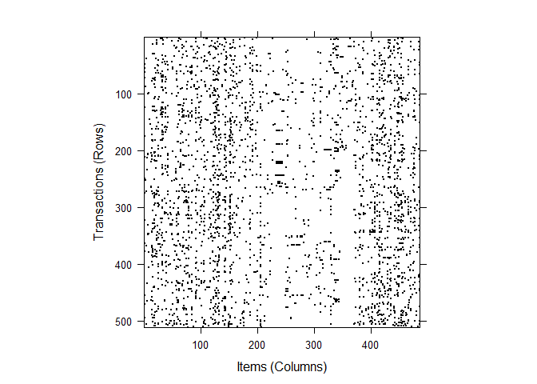
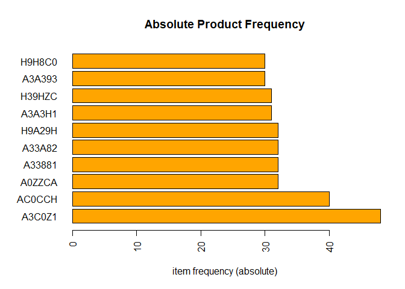
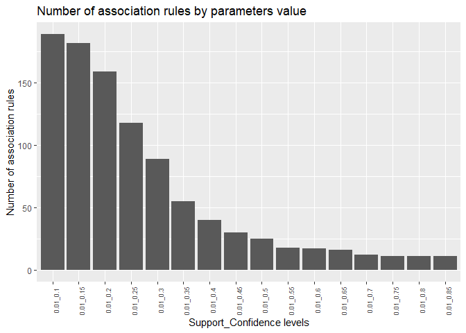
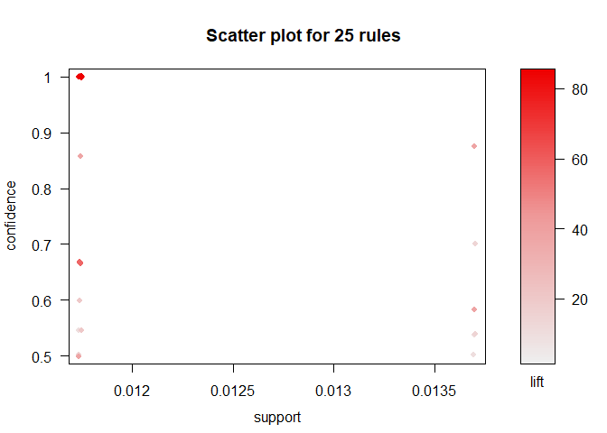
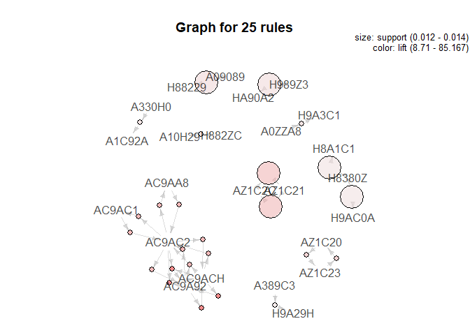

**Orders Analysis with Association Rules**
================
**author**: Maciej Lecicki
28.10.2021

### **Association Rules Mining**

<br/>

Association Rules Mining, commonly called Market Basket Analysis is a
very helpful technique commonly used by retailers to uncover
associations between items. The idea is to define certain (probability)
rules and on that basis identify likelihood that given products’ (items)
will appear in the same transaction (basket). Most common and intuitive
example of products that are bought together is bread and butter.

Market Basket Analysis is based on three key measures: Support, Lift and
Confidence (4th measure, Expected Confidence, can be also considered)
and therefore is easy understand and outcome is easy to explain to
stakeholders. Description of key measures:

-   Support can be described as popularity of item(set); it’s a fraction
    (percentage) of all transactions that contain given item(set),
-   Confidence tells us how often the rule is true; it shows the
    percentage in which item B co-occur with item A,
-   Lift is an indicator of association strength:
    -   lift > 1: B is likely to co-occur with A
    -   lift \< 1: B is unlikely to co-occur with A

The key challenge when performing Market Basket was the size of data to
process. Recently it has become less problematic due to increase of
computational power, however it can still be a problem when summarizing
or visualizing results if rules parameters are incorrect.

### **Association Rules Mining in Supply Chain Management**

Market Basket Analysis can also be applied to supply chain management,
specifically to logistics and warehousing. The scope of the analysis are
customers orders dispatched from a consolidation DC.

The purpose is to investigate if there are any associations between
products which can be foundation for SKUs placement in the same area of
the DC in order to streamline shipping process and reduce warehouse
handling costs related to order preparation process.

### **Analysis**

##### Required packages and dataset

Let’s first upload required packages to perform this analysis.

``` r
library(arules)
library(arulesCBA)
library(arulesViz)
library(htmlwidgets)
library(tidyverse)
```

Next step is to bring in data with customers’ orders in required format.
We’ll use read.transaction function from ‘arules’ library.

``` r
market_order <- read.transactions("data/basket_data.csv",
                                  format = "single",
                                  sep = ",",
                                  header = TRUE,
                                  cols = c("Document", "Product"))
```

##### Data exploration

We can summarize the data to display some simple statistics like number
of transactions (orders), their size or most frequent items (SKUs). We
could use length() and size() function, however good alternative is
summary() which returns enriched piece of information.

``` r
summary(market_order)
```

    ## transactions as itemMatrix in sparse format with
    ##  844 rows (elements/itemsets/transactions) and
    ##  486 columns (items) and a density of 0.008071987 
    ## 
    ## most frequent items:
    ##  A0ZZCZ  A3C0Z1  AC0CCH  A0ZZCA  A33881 (Other) 
    ##      71      48      43      32      32    3085 
    ## 
    ## element (itemset/transaction) length distribution:
    ## sizes
    ##   1   2   3   4   5   6   7   8   9  10  11  12  13  14  15  16  18 
    ## 333  74  63  60  66  72  52  37  24  19  14   6   7   5   8   3   1 
    ## 
    ##    Min. 1st Qu.  Median    Mean 3rd Qu.    Max. 
    ##   1.000   1.000   3.000   3.923   6.000  18.000 
    ## 
    ## includes extended item information - examples:
    ##   labels
    ## 1 20A13C
    ## 2 A0019C
    ## 3 A00801
    ## 
    ## includes extended transaction information - examples:
    ##   transactionID
    ## 1   ABABZ33Z596
    ## 2   ABABZ34569Z
    ## 3   ABABZ345836

There’s 844 transactions (customer orders) and 486 items (products). We
can see that there’s a handful of orders (transactions) with only one
item. Let’s remove them.

``` r
market_order_filter <- market_order[size(market_order) > 1]

summary(market_order_filter)
```

    ## transactions as itemMatrix in sparse format with
    ##  511 rows (elements/itemsets/transactions) and
    ##  486 columns (items) and a density of 0.01199133 
    ## 
    ## most frequent items:
    ##  A3C0Z1  AC0CCH  A0ZZCA  A33881  A33A82 (Other) 
    ##      48      40      32      32      32    2794 
    ## 
    ## element (itemset/transaction) length distribution:
    ## sizes
    ##  2  3  4  5  6  7  8  9 10 11 12 13 14 15 16 18 
    ## 74 63 60 66 72 52 37 24 19 14  6  7  5  8  3  1 
    ## 
    ##    Min. 1st Qu.  Median    Mean 3rd Qu.    Max. 
    ##   2.000   3.000   5.000   5.828   7.000  18.000 
    ## 
    ## includes extended item information - examples:
    ##   labels
    ## 1 20A13C
    ## 2 A0019C
    ## 3 A00801
    ## 
    ## includes extended transaction information - examples:
    ##   transactionID
    ## 1   ABABZ33Z596
    ## 2   ABABZ34569Z
    ## 3   ABABZ345836

Number of transactions has reduced significantly.

Structure of transactions data can be inspected with inspect() function.

``` r
inspect(head(market_order_filter)[1:3])
```

    ##     items    transactionID
    ## [1] {A11A88,              
    ##      A2C332,              
    ##      A3C9AC,              
    ##      A3ZC22,              
    ##      H9H883}   ABABZ33Z596
    ## [2] {A20Z92,              
    ##      A31988,              
    ##      A3199C,              
    ##      AC90HC,              
    ##      H39A38,              
    ##      H9A29H,              
    ##      HA8ZCA}   ABABZ34569Z
    ## [3] {A0ZH83,              
    ##      A0ZZCA,              
    ##      A1CCC9,              
    ##      A33A82,              
    ##      A3A393,              
    ##      AZ1C23,              
    ##      AZ313Z,              
    ##      AZ3188}   ABABZ345836

At this stage we should perform Chi-Square test to check if
co-occurrence of (at least some) items is dependent or not.

HO: co-occurrence of rows & columns (items) is independent (p-value \>
alpha)

HA: co-occurrence of rows & columns (items) is dependent of each other
(p-value \< alpha)

``` r
crossTable(market_order_filter, measure = "chiSquared", sort = TRUE)[1:10, 1:10]
```

    ##              A3C0Z1      AC0CCH       A0ZZCA       A33881      A33A82
    ## A3C0Z1           NA 0.005476486 0.0025889005 0.0006434198 0.005836464
    ## AC0CCH 0.0054764861          NA 0.0017692977 0.0001915090 0.000191509
    ## A0ZZCA 0.0025889005 0.001769298           NA 0.0038909763 0.008766144
    ## A33881 0.0006434198 0.000191509 0.0038909763           NA 0.062438860
    ## A33A82 0.0058364645 0.000191509 0.0087661445 0.0624388604          NA
    ## H9A29H 0.0006587084 0.015785932 0.0039215536 0.0039215536 0.003921554
    ## A3A3H1 0.0112313548 0.001996405 0.0094311463 0.0166059617 0.001129903
    ## H39HZC 0.0029301112 0.016867625 0.0011299027 0.0257969061 0.009431146
    ## A3A393 0.0033063242 0.005859432 0.0101486516 0.0273208629 0.052826408
    ## H9H8C0 0.0033063242 0.002273327 0.0008042289 0.0008042289 0.003676457
    ##              H9A29H      A3A3H1       H39HZC      A3A393       H9H8C0
    ## A3C0Z1 0.0006587084 0.011231355 2.930111e-03 0.003306324 3.306324e-03
    ## AC0CCH 0.0157859317 0.001996405 1.686763e-02 0.005859432 2.273327e-03
    ## A0ZZCA 0.0039215536 0.009431146 1.129903e-03 0.010148652 8.042289e-04
    ## A33881 0.0039215536 0.016605962 2.579691e-02 0.027320863 8.042289e-04
    ## A33A82 0.0039215536 0.001129903 9.431146e-03 0.052826408 3.676457e-03
    ## H9A29H           NA 0.003799005 3.799005e-03 0.003676457 4.687546e-03
    ## A3A3H1 0.0037990051          NA 1.012538e-02 0.055433293 3.561567e-03
    ## H39HZC 0.0037990051 0.010125383           NA 0.001497304 3.485386e-05
    ## A3A393 0.0036764565 0.055433293 1.497304e-03          NA 3.446678e-03
    ## H9H8C0 0.0046875459 0.003561567 3.485386e-05 0.003446678           NA

On the basis of visual inspection of sub-matrix made of ten most
frequent items we can reject Null Hypothesis (H0) in favor of
Alternative Hypothesis as we can find examples of alpha values greater
than p-value of 0.05.

Let’s see transactions sparsity.

``` r
image(market_order_filter)
```

<!-- -->

Most frequent items can also be visualized.

``` r
itemFrequencyPlot(market_order_filter,
                  topN = 10,
                  main = "Absolute Product Frequency",
                  type = "absolute",
                  horiz = TRUE,
                  col = "orange")
```

<!-- -->

##### Association Rules Mining

Having confirmed co-occurrence of items we can perform Association Rules
Mining.

First step is define values of parameters for association rules (in
other words, we need to decide on thresholds for key metrics). It’s an
important step when we deal with large datasets as it will define the
number of association rules and therefore granularity of analysis and
its outcome. It is recommended to use expertise knowledge to find the
optimal number applicable to a given business environment, however this
process can be supported with visual representation of numbers of
expected rules.

This task is usually done on the basis of Confidence and Support. Let’s
define a grid of parameters and investigate thresholds that will help us
select optimal number of rules captured by iterating apriori algorithm
over the grid.

``` r
# selecting support & confidence level parameters

supp_lev <- seq(from = 0.01, to = 0.2, by = 0.01)
conf_lev <- seq(from = 0.1, to = 0.9, by = 0.05)

par_check <- expand.grid(supp_level = supp_lev, 
                         conf_level = conf_lev) %>%
  cbind(count = NA)


for (i in 1:nrow(par_check)) {
  par_check[i, 3] =
    length(apriori(market_order_filter,
                   parameter = list(supp = par_check[i, 1],
                                    conf = par_check[i, 2],
                                    target = "rules")))
}
```

Let’s filter entire dataset to return a pair of association metrics that
return at least 10 rules.

``` r
par_check_filter <- par_check %>%
  as_tibble() %>%
  filter(count >= 10) %>%
  mutate(
    supp_level = as.character(supp_level),
    conf_level = as.character(conf_level)) %>%
  unite(col = par_pair,
        supp_level, 
        conf_level,
        remove = FALSE)
```

Results can be visualized with a help of ggplot package.

``` r
ggplot(par_check_filter,
       aes(x = par_pair,
           y = count)) +
  geom_col() +
  theme(
    axis.text.x = element_text(angle = 90,
                               size = 7)
  ) +
  labs(title = "Number of association rules by parameters value",
       x =  "Support_Confidence levels",
       y = "Number of association rules")
```



Let’s use support level of 0.01 and confidence of 0.5. In other words,
we pick items that appear at least in 1% of all transactions and minimum
confidence of 50% that co-occurrence between items is true.

To uncover rules, apriori function (algorithm) is used. What’s returned
is controlled by target parameter. Let’s first set it to ‘frequent
itemsets’, .

``` r
trans_frequent <- apriori(market_order_filter,
                         parameter = list(
                           supp = 0.01,
                           conf = 0.5,
                           target = "frequent itemsets")
                         )
```

Results can be retrieved with inspect() function.

``` r
prod_apriori_inspect <- inspect(head(sort(trans_frequent, 
                                     by = "support")
                                )
)
```

Kable() function offers nice formatting.

``` r
prod_apriori_inspect %>% 
  knitr::kable()
```

|       | items    |   support | transIdenticalToItemsets | count |
|-------|:---------|----------:|-------------------------:|------:|
| \[1\] | {A3C0Z1} | 0.0939335 |                0.0000000 |    48 |
| \[2\] | {AC0CCH} | 0.0782779 |                0.0058708 |    40 |
| \[3\] | {H9A29H} | 0.0626223 |                0.0000000 |    32 |
| \[4\] | {A0ZZCA} | 0.0626223 |                0.0000000 |    32 |
| \[5\] | {A33A82} | 0.0626223 |                0.0000000 |    32 |
| \[6\] | {A33881} | 0.0626223 |                0.0000000 |    32 |

Setting target to ‘rules’ allows inspection of association rules and all
key metrics they’re based on.

``` r
trans_rules <- apriori(market_order_filter,
                         parameter = list(
                           supp = 0.01,
                           conf = 0.5,
                           target = "rules"),
                      control = list(verbose = FALSE)
)

#saveRDS(trans_rules, file = 'data/trans_rules.RDS')
```

``` r
trans_rules_inspect <- inspect(head(
  sort(
    trans_rules, 
    by = "lift")
  )
)
```

``` r
trans_rules_inspect %>%
  knitr::kable()
```

|       | lhs             |     | rhs      |   support | confidence |  coverage |     lift | count |
|-------|:----------------|-----|:---------|----------:|-----------:|----------:|---------:|------:|
| \[1\] | {AC9ACH}        | =>  | {AC9A92} | 0.0117417 |          1 | 0.0117417 | 85.16667 |     6 |
| \[2\] | {AC9A92}        | =>  | {AC9ACH} | 0.0117417 |          1 | 0.0117417 | 85.16667 |     6 |
| \[3\] | {AC9AC2,AC9ACH} | =>  | {AC9A92} | 0.0117417 |          1 | 0.0117417 | 85.16667 |     6 |
| \[4\] | {AC9A92,AC9AC2} | =>  | {AC9ACH} | 0.0117417 |          1 | 0.0117417 | 85.16667 |     6 |
| \[5\] | {AC9AA8}        | =>  | {AC9AC2} | 0.0117417 |          1 | 0.0117417 | 56.77778 |     6 |
| \[6\] | {AC9AC1}        | =>  | {AC9AC2} | 0.0117417 |          1 | 0.0117417 | 56.77778 |     6 |

Rules can also be subset based on certain conditions.

``` r
rules_subset <- inspect(subset(trans_frequent,
                               subset = items %in% c("A338HC") & support > 0.01)
                        )
```

``` r
rules_subset %>%
  knitr::kable()
```

|       | items           |   support | transIdenticalToItemsets | count |
|-------|:----------------|----------:|-------------------------:|------:|
| \[1\] | {A338HC}        | 0.0450098 |                        0 |    23 |
| \[2\] | {A338HC,ACZ029} | 0.0117417 |                        0 |     6 |
| \[3\] | {A338HC,H39A38} | 0.0117417 |                        0 |     6 |
| \[4\] | {A338HC,A3H933} | 0.0136986 |                        0 |     7 |
| \[5\] | {A338HC,H9A29H} | 0.0176125 |                        0 |     9 |

##### Rules visualization

Association rules can be visualized. In addition to that, good level of
interaction is provided. This is github_document hence interactive
output cannot be generated. I encourage therefore to run it in R Studio
or change yaml output type to ‘html_document’ (which unfortunately is
too big to open in github).

-   plot

``` r
plot(trans_rules, engine = "default") # change to 'plotly'
```

<!-- -->

-   graph (interactive mode set by ‘htmlwidgets’ engine is disabled)

``` r
plot(trans_rules, method = "graph",
     engine = "default") # change to 'htmlwidget'
```

<!-- -->

Html widgets can be saved for future use:

``` r
# rules_html = plot(trans_rules, method = "graph",
#                   engine = "htmlwidget")
# saveWidget(rules_html, file = "trans_rules.html")
# saveAsGraph(rules_html, file = "trans_rules.graphml")
```

-   interactive items selection (commented out due to output type)

``` r
#inspectDT(trans_rules)
```

##### Shiny app

Association rules can be also shared with users in the form of web
application through Shiny package with one line of code presented below.
As it cannot be output in github_document, the code is commented out.
Please run it directly in R to see result!

``` r
#ruleExplorer(trans_rules)
```

### **Summary and Conclusion**

Market Basket Analysis, mostly applied in retail, has proven to have a
great potential in Supply Chain Management.

Key benefits of this approach are:

-   unlike ‘black box’ solutions based on Machine or Deep learning is
    very intuitive and easy to explain to key stakeholders across the
    organization as it’s based on 3 measures (Support, Confidence and
    Lift),
-   it can be performed in open source software (R) which also provides
    front-end for final users in a form of interactive web app.

Identified associations between items can be used to streamline dispatch
process and help reduce warehousing costs.
